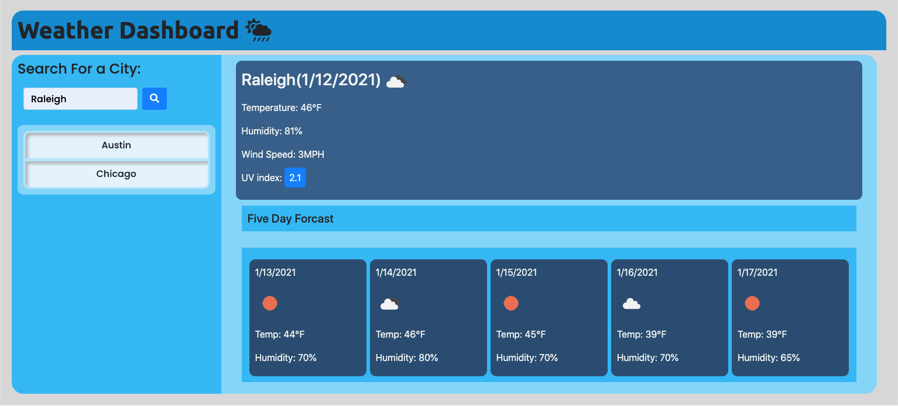

# **Weather Dashboard**

## Description 
Created a Weather Dashboard that will run in the browser and feature dynamically updated HTML and CSS.

Used the [OpenWeather API](https://openweathermap.org/api) to retrieve weather data for cities. THis app Uses "localStorage" to store any persistent data.

## Table of contents
- [Description](#Description)
- [Installation](#Installation)
- [Usage](#Usage)
- [Repository Link](#Repository)
- [GitHub Info](#GitHub) 

## Screenshots

## Installation
        Runs in Web Browser
## Usage
- [Weather-Dashboard](https://bartcusick.github.io/Weather-Dashboard/)
## Repository
- [Weather-Dashboard Repo](https://github.com/bartcusick/Weather-Dashboard)
## GitHub
- Email: bartcusick@gmail.com
- [GitHub Profile](https://github.com/bartcusick)
